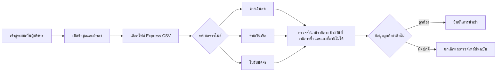
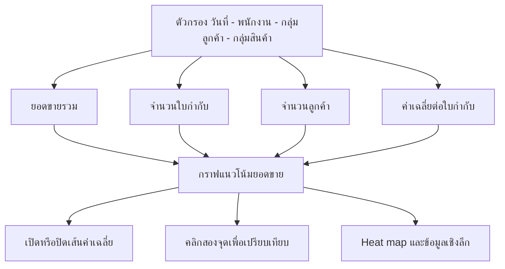
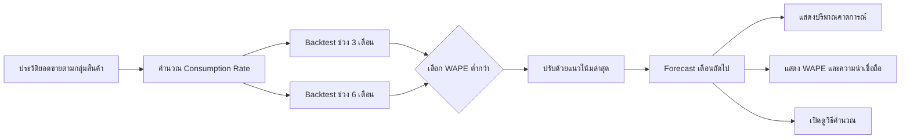
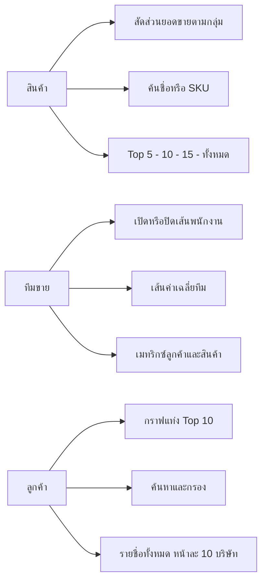

# คู่มือการใช้งาน Monthly Sales Forecast Assistant

เว็บไซต์: [https://kisstk322.github.io/Monthly-Sales-Forecast-Assistant/](https://kisstk322.github.io/Monthly-Sales-Forecast-Assistant/)

คู่มือนี้อธิบายการใช้งานตั้งแต่หน้าแรกจนถึงทุกเมนูในระบบ สำหรับผู้ใช้ทั่วไป ไม่จำเป็นต้องมีความรู้ด้านโปรแกรม

## 1. หน้าแรก: เลือกบทบาท

เมื่อเปิดเว็บไซต์ ระบบจะแสดงหน้า **Choose how you want to enter / เลือกบทบาทที่ต้องการเข้าใช้งาน**

มี 4 บทบาท:

| บทบาท | ใช้สำหรับ |
| --- | --- |
| **พนักงานขาย** | ดูยอดขายเฉพาะของตนเอง |
| **หัวหน้าฝ่ายขาย** | ดูภาพรวม คาดการณ์ สินค้า ทีมขาย และลูกค้าของทั้งทีม |
| **Management Team / ผู้บริหาร** | ดูข้อมูลทั้งหมด นำเข้าข้อมูล สำรองข้อมูล และส่งออกรายงาน |
| **ทีมเทคนิค** | ดูสถานะและรีเซ็ตรหัสผ่านของผู้ใช้งานในเครื่องนี้ |

### วิธีเข้าใช้งานครั้งแรก

1. กดปุ่มของบทบาทที่ต้องการ
2. ระบบจะแสดงหน้าตั้งรหัสผ่าน
3. พิมพ์รหัสผ่านและยืนยันรหัสอีกครั้ง
4. กดปุ่มยืนยัน
5. ครั้งต่อไปให้ใช้รหัสเดิมเพื่อเข้าสู่บทบาทนั้น

รหัสผ่านถูกเก็บเฉพาะในเบราว์เซอร์เครื่องที่กำลังใช้งาน หากเปลี่ยนเครื่อง เปลี่ยนเบราว์เซอร์ หรือล้างข้อมูลเว็บไซต์ อาจต้องตั้งรหัสใหม่

## 2. ส่วนหัวของเว็บไซต์

หลังเข้าสู่ระบบ ด้านบนของหน้าจอมีเครื่องมือดังนี้:

- **เมนูบทบาท:** แสดงบทบาทที่กำลังใช้งานและใช้เปลี่ยนไปบทบาทอื่น
- **ออกจากมุมมอง:** ออกจากบทบาทปัจจุบันและกลับไปหน้าเลือกบทบาท
- **รูปเฟือง ⚙:** เปิดการตั้งค่า ภาษา ธีม และการติดตั้งแอป
- **ส่งออกสรุป:** แสดงเมื่อเข้าสู่บทบาทผู้บริหารและมีข้อมูลพร้อมใช้งาน

### การเปลี่ยนบทบาท

1. กดชื่อบทบาทบนส่วนหัว
2. เลือกบทบาทใหม่
3. กรอกรหัสผ่านของบทบาทปลายทาง
4. ระบบจะเปลี่ยนเมนูและสิทธิ์ให้ตามบทบาทใหม่

## 3. การนำเข้าข้อมูลจาก Express

การนำเข้าข้อมูลทำได้เฉพาะบทบาท **Management Team / ผู้บริหาร**

### ไฟล์ที่รองรับ

ระบบอ่านรายงาน CSV จาก Express ได้ 3 ประเภท:

1. รายงานขายเงินสด
2. รายงานขายเงินเชื่อหรือใบกำกับสินค้า
3. รายงานใบรับมัดจำ

### ขั้นตอนนำเข้า

1. เข้าสู่ระบบด้วยบทบาท **ผู้บริหาร**
2. เปิดเมนู **ข้อมูลและสำรอง** หรือส่วน **นำเข้า CSV จาก Express** ที่หน้าแรก
3. กดช่องเลือกไฟล์
4. เลือกไฟล์ CSV จาก Express ที่ต้องการ สามารถเลือกหลายไฟล์พร้อมกันได้
5. รอให้ระบบอ่านไฟล์
6. อ่านกล่องสรุปก่อนนำเข้า ซึ่งจะแสดงประเภทไฟล์ ช่วงวันที่ จำนวนรายการ สินค้า ลูกค้า และรายการซ้ำ
7. ถ้าข้อมูลถูกต้อง ให้กดยืนยัน
8. เปิดหน้า **ภาพรวม** เพื่อตรวจสอบยอดและช่วงวันที่อีกครั้ง

ระบบจะไม่แทนที่ข้อมูลเดิมจนกว่าผู้ใช้จะกดยืนยัน หากไฟล์มีปัญหา ข้อมูลเดิมจะยังคงอยู่

## 4. ตัวกรองข้อมูล

หน้ารายงานส่วนใหญ่มีตัวกรองด้านบน เช่น:

- จากวันที่
- ถึงวันที่
- พนักงานขาย
- กลุ่มลูกค้า
- กลุ่มสินค้า

เมื่อเปลี่ยนตัวกรอง กราฟ ตาราง และยอดรวมในหน้านั้นจะเปลี่ยนตาม

กด **ล้างตัวกรอง** เมื่อต้องการกลับไปดูข้อมูลทั้งหมด

## 5. เมนูภาพรวม

หน้า **ภาพรวม** ใช้ดูผลงานยอดขายโดยรวมในช่วงวันที่ที่เลือก

### ฟังก์ชันในหน้านี้

- ดูยอดขายรวม
- ดูจำนวนใบกำกับ
- ดูจำนวนลูกค้า
- ดูค่าเฉลี่ยยอดขายต่อใบกำกับ
- เปรียบเทียบยอดขายกับช่วงก่อนหน้า
- ดูกราฟแนวโน้มยอดขายรายวันหรือรายเดือน
- เปิดหรือปิดเส้นค่าเฉลี่ยบนกราฟ
- ดูตัวเลขของเส้นค่าเฉลี่ย
- คลิกจุดบนกราฟ 2 จุดเพื่อเปรียบเทียบ
- ดู Heat map หรือปฏิทินความเข้มยอดขาย
- ดูการเปลี่ยนแปลงของยอดขายสินค้า
- ดูข้อมูลเชิงลึกสำหรับผู้บริหาร

### การเปรียบเทียบจุดบนกราฟ

1. คลิกจุดแรกบนกราฟ
2. คลิกจุดที่สอง
3. ระบบจะแสดงความแตกต่างระหว่างสองจุด
4. คลิกจุดที่สามเพื่อเริ่มการเปรียบเทียบใหม่

## 6. เมนูคาดการณ์ยอดขาย

หน้า **คาดการณ์ยอดขาย** ใช้ดูความต้องการสินค้าที่ระบบคำนวณให้อัตโนมัติจากประวัติการขาย

ผู้ใช้ไม่ต้องกรอกตัวเลขคาดการณ์เอง

### ฟังก์ชันในหน้านี้

- คาดการณ์ปริมาณความต้องการเดือนถัดไปตามกลุ่มสินค้า
- คำนวณจาก Consumption Rate หรืออัตราการใช้สินค้า
- เปรียบเทียบประวัติย้อนหลัง 3 เดือนและ 6 เดือน
- เลือกวิธีที่มีความคลาดเคลื่อนต่ำกว่าโดยอัตโนมัติ
- แสดงปริมาณขายจริงในแต่ละเดือน
- แสดงปริมาณที่คาดการณ์สำหรับเดือนถัดไป
- แสดง Demand Class หรือรูปแบบความสม่ำเสมอของความต้องการ
- แสดง WAPE หรือค่าความคลาดเคลื่อนของการคาดการณ์
- แสดง Heat map รูปแบบยอดขายรายเดือน
- แสดงสินค้าขายดี
- กรอกจำนวนสต็อกเพื่อดูจำนวนวันที่คาดว่าสต็อกจะพอใช้
- เปิดดูวิธีคำนวณและค่าที่ใช้ในสูตร

### วิธีเปิดดูการคำนวณ

1. เลื่อนลงใต้กราฟคาดการณ์
2. กดหัวข้อ **วิธีคำนวณการคาดการณ์**
3. ระบบจะแสดงสูตร อัตราการใช้ ช่วงข้อมูล และค่าความคลาดเคลื่อน
4. กดหัวข้อเดิมอีกครั้งเพื่อย่อข้อมูล

### การอ่าน WAPE

WAPE ย่อมาจาก **Weighted Absolute Percentage Error** หรือค่าความคลาดเคลื่อนสัมบูรณ์ถ่วงน้ำหนัก

- WAPE ต่ำ หมายถึงผลย้อนหลังใกล้เคียงยอดจริงมากกว่า
- WAPE สูง หมายถึงควรใช้ความระมัดระวังในการตัดสินใจ
- ต้องอ่านตัวเลขคาดการณ์ร่วมกับ WAPE ทุกครั้ง

ผลคาดการณ์เป็นข้อมูลช่วยตัดสินใจ ไม่ใช่การรับประกันยอดขายหรือคำสั่งซื้อสินค้าอัตโนมัติ

## 7. เมนูสินค้า

หน้า **สินค้า** ใช้วิเคราะห์ว่าสินค้าหรือกลุ่มสินค้าใดสร้างยอดขายมากที่สุด

### ฟังก์ชันในหน้านี้

- ดูกราฟสัดส่วนยอดขายตามกลุ่มสินค้า
- เลือกจำนวนรายการที่แสดง เช่น Top 5, Top 10, Top 15 หรือทั้งหมด
- จัดอันดับสินค้าตามยอดขาย
- จัดอันดับตามจำนวน เมื่อสินค้ามีหน่วยเดียวกัน
- ค้นหาจากชื่อสินค้าหรือ SKU
- กรองตามกลุ่มรหัส SKU
- ดูจำนวนที่ขาย ยอดขาย และหน่วยสินค้า
- ดูรายละเอียดสินค้าแต่ละรายการ
- วิเคราะห์ประเภทลอน สี และความหนาจากรายละเอียดสินค้า
- เปิดสินค้าที่เลือกไปยังหน้าคาดการณ์

### เปิดสินค้าจากตารางไปหน้าคาดการณ์

1. ค้นหาสินค้าหรือ SKU
2. กด **คาดการณ์ →** ในแถวสินค้า
3. ระบบจะเปิดหน้าคาดการณ์
4. สินค้าที่เลือกจะถูกเน้นให้มองเห็นง่าย

## 8. เมนูทีมขาย

หน้า **ทีมขาย** ใช้เปรียบเทียบผลงานของพนักงานขาย

### ฟังก์ชันในหน้านี้

- เลือกพนักงานที่ต้องการแสดงบนกราฟ
- เปิดหรือปิดเส้นของพนักงานแต่ละคน
- เปิดหรือปิดเส้นค่าเฉลี่ยของทีม
- ดูตัวเลขค่าเฉลี่ย
- เปรียบเทียบยอดขายตามวันที่
- คลิก 2 จุดบนกราฟเพื่อดูส่วนต่าง
- ดูยอดขายรวมของพนักงาน
- ดูจำนวนใบกำกับ
- ดูค่าเฉลี่ยยอดขายต่อใบกำกับ
- ดูเมทริกซ์พนักงานกับกลุ่มลูกค้า
- ดูเมทริกซ์พนักงานกับกลุ่มสินค้า

## 9. เมนูลูกค้า

หน้า **ลูกค้า** ใช้ดูยอดขายตามบริษัทลูกค้าและค้นหารายละเอียดลูกค้า

### ฟังก์ชันในหน้านี้

- ดูยอดขายรวมของลูกค้าทั้งหมด
- ดูจำนวนบริษัท
- ดูจำนวนใบกำกับ
- ดูกราฟแท่งลูกค้า Top 10
- ดูเปอร์เซ็นต์ส่วนแบ่งยอดขายของแต่ละบริษัท
- ค้นหาชื่อลูกค้าหรือรหัสลูกค้า
- กรองตามสินค้า/SKU
- กรองตามพนักงานขาย
- กรองตามกลุ่มลูกค้า
- กรองตามกลุ่มสินค้า
- ดูรายชื่อบริษัททั้งหมด
- แบ่งรายการเป็นหน้าละ 10 บริษัท
- ใช้ปุ่มก่อนหน้าและถัดไปเพื่อเปลี่ยนหน้า

## 10. เมนูยอดขายของฉัน

เมนูนี้แสดงสำหรับบทบาท **พนักงานขาย**

### ฟังก์ชันในหน้านี้

- ดูยอดขายเฉพาะของพนักงานที่เข้าสู่ระบบ
- เลือกช่วงวันที่
- ค้นหาลูกค้า
- ค้นหาสินค้าหรือ SKU
- ดูยอดขายและรายการที่เกี่ยวข้องกับตนเอง

พนักงานขายไม่สามารถเปิดดูยอดขายรายบุคคลของพนักงานคนอื่น

## 11. เมนูข้อมูลและสำรอง

เมนูนี้แสดงสำหรับบทบาท **ผู้บริหาร**

### ฟังก์ชันในหน้านี้

- นำเข้า CSV จาก Express
- ตรวจประเภทไฟล์ที่ระบบพบ
- ตรวจรายการซ้ำและรายการที่อ่านไม่ได้
- ดาวน์โหลดข้อมูลสำรองเป็น JSON
- บันทึกข้อมูลไว้ในเบราว์เซอร์เครื่องนี้
- โหลดข้อมูลที่บันทึกไว้
- ลบสำเนาข้อมูลที่บันทึกไว้ในเครื่อง
- กู้คืนข้อมูลจากไฟล์ JSON

### ดาวน์โหลดข้อมูลสำรอง

1. เปิดเมนู **ข้อมูลและสำรอง**
2. กด **ดาวน์โหลดข้อมูลสำรอง**
3. เบราว์เซอร์จะดาวน์โหลดไฟล์ `.json`
4. เก็บไฟล์ไว้ในพื้นที่ปลอดภัย

### กู้คืนข้อมูลสำรอง

1. เปิดช่องนำเข้าไฟล์
2. เลือกไฟล์ `.json` ที่สำรองไว้
3. ตรวจข้อความยืนยัน
4. กดยืนยันเพื่อโหลดข้อมูล

ไฟล์ JSON อาจมีข้อมูลยอดขายและลูกค้า จึงไม่ควรแชร์ภายนอกบริษัท

## 12. การส่งออกรายงาน

บทบาทผู้บริหารสามารถกด **ส่งออกสรุป** ที่ส่วนหัวของเว็บไซต์

มีรูปแบบดังนี้:

- **Excel (.xlsx):** สำหรับนำตัวเลขไปทำงานต่อ
- **รายงาน PDF A4:** สำหรับอ่านหรือส่งเอกสาร
- **สไลด์ PDF 16:9:** สำหรับนำเสนอในที่ประชุม

ไฟล์ส่งออกจะใช้ช่วงวันที่และตัวกรองที่กำลังเลือกอยู่ ควรตรวจตัวกรองก่อนส่งออกทุกครั้ง

## 13. การตั้งค่า

กดรูปเฟือง **⚙** ที่มุมขวาบน

### ฟังก์ชันในเมนูตั้งค่า

- เปลี่ยนภาษาไทยหรืออังกฤษ
- เลือกธีมสว่าง
- เลือกธีมมืด
- เลือกธีมตามระบบ
- ดูเวอร์ชันของแอป
- ดูคำแนะนำการติดตั้งเป็นแอป

การเปลี่ยนภาษาและธีมไม่ล้างข้อมูลหรือตัวกรองที่กำลังใช้งาน

## 14. ติดตั้งเว็บไซต์ลงหน้าจอโฮม

เว็บไซต์รองรับ PWA จึงสามารถติดตั้งเป็นไอคอนบนโทรศัพท์ได้

### iPhone หรือ iPad

1. เปิดเว็บไซต์ด้วย Safari
2. แตะปุ่ม **Share / แชร์**
3. เลือก **Add to Home Screen / เพิ่มไปยังหน้าจอโฮม**
4. หากมี **Open as Web App** ให้เปิดไว้
5. แตะ **Add / เพิ่ม**
6. เปิดเว็บไซต์ครั้งต่อไปจากไอคอนบนหน้าจอโฮม

หากเปิดลิงก์จาก LINE, Facebook หรือแอปอื่น ให้เลือก **เปิดใน Safari** ก่อน

### Android

1. เปิดเว็บไซต์ด้วย Chrome
2. กดรูปเฟืองในเว็บไซต์และดูหัวข้อ Install/App หรือเปิดเมนู Chrome
3. เลือก **Install app** หรือ **Add to Home screen**
4. ยืนยันการติดตั้ง

## 15. การใช้งานออฟไลน์และอัปเดต

- ต้องเปิดเว็บไซต์ออนไลน์สำเร็จอย่างน้อย 1 ครั้งก่อน
- หลังจากนั้นตัวเว็บไซต์สามารถเปิดจาก cache ได้เมื่อไม่มีอินเทอร์เน็ต
- ระบบจะแสดงคำว่า **ออฟไลน์** เมื่อไม่มีเครือข่าย
- เมื่อมีเวอร์ชันใหม่ ระบบจะแสดงแถบแจ้งเตือน
- กด **โหลดใหม่** เพื่อเปลี่ยนไปใช้เวอร์ชันล่าสุด
- ควรดาวน์โหลด JSON สำรองก่อนล้างข้อมูลเว็บไซต์หรือเปลี่ยนอุปกรณ์

## 16. การแก้ปัญหาเบื้องต้น

| ปัญหา | วิธีแก้ |
| --- | --- |
| เมนูไม่แสดง | ตรวจว่าบทบาทปัจจุบันมีสิทธิ์ใช้เมนูนั้นหรือไม่ |
| เปลี่ยนบทบาทไม่ได้ | ปิดเมนูที่ค้าง เปิดใหม่ และกรอกรหัสของบทบาทปลายทาง |
| CSV อ่านไม่ได้ | ใช้ไฟล์ต้นฉบับจาก Express ที่ยังไม่ได้แก้รูปแบบคอลัมน์ |
| ภาษาไทยใน CSV ผิด | ตรวจว่าเป็นไฟล์ CSV ต้นฉบับแบบ Windows-874 หรือ UTF-8 ที่รองรับ |
| ไม่พบปุ่มติดตั้งบน iPhone | เปิดใน Safari แล้วใช้ Share → Add to Home Screen |
| เปิดจาก LINE แล้วติดตั้งไม่ได้ | เลือกเปิดใน Safari หรือ Chrome ก่อน |
| เปิดออฟไลน์ไม่ได้ | ต้องเคยเปิดเว็บไซต์ออนไลน์สำเร็จอย่างน้อยหนึ่งครั้ง |
| เห็นหน้าเวอร์ชันเก่า | ต่ออินเทอร์เน็ต รอแถบอัปเดต แล้วกดโหลดใหม่ |
| ข้อมูลหายหลังเปลี่ยนเครื่อง | กู้คืนจากไฟล์ JSON เพราะข้อมูลในเบราว์เซอร์ไม่ย้ายตามเครื่อง |

## 17. ข้อควรทราบ

- ข้อมูลจาก CSV ถูกอ่านบนอุปกรณ์และไม่ได้อัปโหลดไปยังเซิร์ฟเวอร์ของระบบนี้
- รหัสผ่านเป็น privacy lock ในเบราว์เซอร์ ไม่ใช่ระบบบัญชีระดับ production
- ข้อมูลที่บันทึกในเบราว์เซอร์และไฟล์ JSON ไม่ได้เข้ารหัส
- Forecast เป็นเครื่องมือช่วยตัดสินใจ ไม่ใช่คำรับรองยอดขาย
- Consumption Rate คำนวณจากปริมาณขาย ไม่ใช่ยอดเบิกสินค้าจากคลัง
- การคาดการณ์ระดับ SKU เป็นข้อมูลอ้างอิง ควรใช้การคาดการณ์ระดับกลุ่มสินค้าเป็นหลัก
- จำนวนวันที่สต็อกพอใช้จะคำนวณได้ต่อเมื่อผู้ใช้กรอกยอดสต็อก
- ควรตรวจตัวเลขและบริบททางธุรกิจก่อนนำผลไปตัดสินใจจริง
