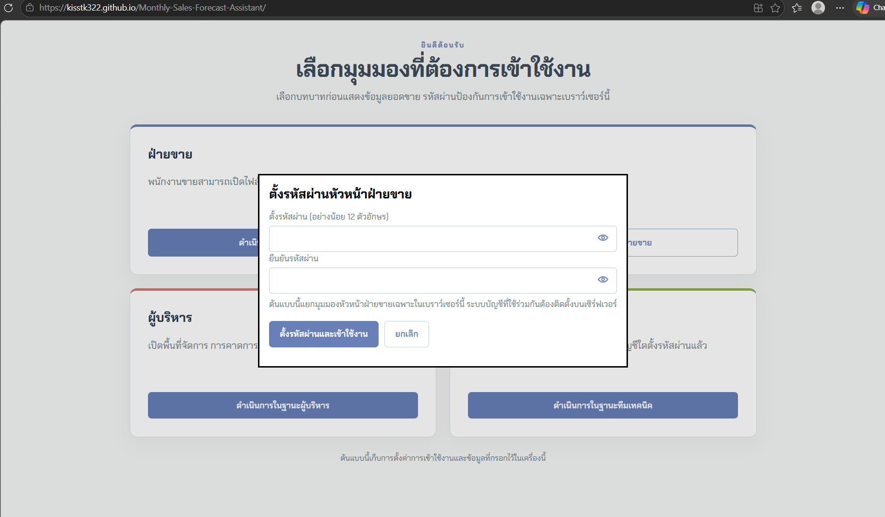
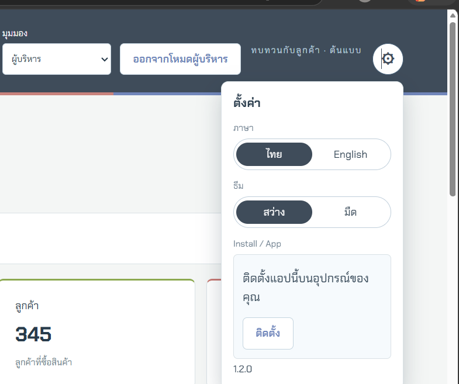

# Monthly Sales Forecast Assistant

A Thai/English sales dashboard and next-month demand-forecast tool for a domestic metal-roofing and PU-insulation manufacturer. It reads the company's three Express accounting exports (cash sales, credit sales, deposit receipts) directly in the browser and turns them into a forecast, a best-seller/stock-cover view, and team/customer reporting — nothing is uploaded to a server.

University workshop project ("Vibe Coding").

## 1. How to use it

**Live site:** [kisstk322.github.io/Monthly-Sales-Forecast-Assistant](https://kisstk322.github.io/Monthly-Sales-Forecast-Assistant/)

The address above (no `/index.html` needed) is served by GitHub Pages and was confirmed working (`HTTP 200`) right before this document was written. Open it, pick a role on the welcome screen, and (as Management) import the three Express CSV files from the **Data & backup** tab.

### Run it locally instead

No build step and no dependencies — it's plain HTML/CSS/JS.

```bash
git clone https://github.com/KissTK322/Monthly-Sales-Forecast-Assistant.git
cd Monthly-Sales-Forecast-Assistant
npx serve -l 8000
# or: python -m http.server 8000
```

Then open `http://localhost:8000`. A service worker will not run from a double-clicked file, so it must be served over `http://` or `https://`.

Optional: `node build.cjs` bundles everything into a single offline `dist/index.html` file (no service worker in that build). Automated tests: `node --test tests/*.test.cjs` — 30 tests, currently all passing.

## 2. Roles

Chosen on the welcome screen before any sales data is shown. Each passcode is hashed (PBKDF2-SHA256, 600,000 iterations) and stored only in that browser's `localStorage` — nothing is sent anywhere, and switching browsers or devices means setting the passcode again.

| Role | Access |
| --- | --- |
| **Salesperson** | Picks their own imported salesperson ID and sets a 6-character passcode. Sees only their own sales ("My sales" tab). Cannot import data. |
| **Supervisor** | Everything except the Data & backup tab: overview, forecast, products, sales team, customers, for every salesperson. 12+ character passcode. Cannot import or replace data. |
| **Management** | Everything Supervisor has, plus the Data & backup tab: import Express CSVs, download/restore JSON backups, and manage products/customers/salespeople. 12+ character passcode. |
| **Tech Team** | A single "Password support" screen to reset the Supervisor, Management, or an individual salesperson's passcode on that browser. It has no access to any sales, product, or customer data — resetting a passcode does not reveal it. |



## 3. Importing data

Only the **Management** role can import. From the **Data & backup** tab, use "Import CSV from Express" and select the three report files together (or add more later — see below).

The importer identifies each file by the report title printed inside it, not by filename:

| Text found in the file | Treated as |
| --- | --- |
| `รายงานขายเงินสด` | Cash sales |
| `รายงานใบกำกับสินค้า` | Credit sales |
| `รายงานใบรับมัดจำ` | Deposit receipts |

Express exports these reports in Windows-874 (Thai TIS-620) encoding. The importer decodes each file both as UTF-8 and as Windows-874, scores which result reads as more plausible Thai text, and keeps that one automatically — there is no encoding option to set.

Before anything is applied, a confirmation dialog shows what was parsed (sale-line, product, customer and deposit counts) and asks you to confirm replacing the current dashboard, so a bad file never silently overwrites good data.

**Deposit-only follow-up imports:** if you already have cash or credit sales loaded, you can later import just a new deposit-receipts file on its own — it merges into the existing dataset instead of requiring you to reselect everything. A deposit file can never be used to *start* a dataset on its own, since it carries no sales date to set the reporting month from.

JSON backups (see §6) can be reloaded through the same file picker.

## 4. Main features

- **Demand forecast (headline: group level).** Products are grouped by their 2-digit code prefix. For each group, the model computes a weighted monthly consumption rate with a damped trend, picking a 3- or 6-month window per group by backtest. The forecast's **WAPE (error) is always shown next to the number** — it is graded good/fair/weak/unusable, but a high error never hides the figure. A group needs sales in roughly a third of the imported months' history to get a number at all; below that, the dashboard states why instead of guessing. A monthly pattern heatmap (one row per group, columns following however many months of history are actually loaded — not a fixed count) sits alongside the demand-class label it produced.
- **Best sellers with days of cover (C1).** Ranks groups by quantity or revenue sold in the selected date range, with a sparkline of the last 6 months. Typing a stock figure per group shows days-of-cover for that group; nothing is assumed if you leave it blank, and the figure is not saved between sessions.
- **Per-SKU consumption (reference table only).** The original per-product forecast is still shown, but explicitly labelled unreliable — it measures roughly 78% WAPE on the real data — and the group-level forecast above is the one meant to be used.
- **Products.** Revenue share by product group, a Top-5 ranking (by revenue or by quantity within one unit), a searchable product detail table, and a ranking by parsed attributes (roofing profile, colour, thickness) read from the item descriptions.
- **Sales team.** Per-salesperson totals, a salesperson × customer-segment matrix, and a salesperson × product-group heatmap matrix.
- **Customers.** Revenue share by customer company and a searchable, filterable, paginated customer ranking.
- **Overview.** Headline KPIs and trends for Management and Supervisor.

Product group codes are matched against a small built-in name table; a group not in that table is labelled with a note that the name is temporary and pending confirmation.

## 5. Installing / offline use

The app is an installable PWA (`manifest.webmanifest`, versioned service worker in `sw.js`).

**In the app itself**, the gear icon (⚙, top-right of the header) opens Settings, which has an **"Install / App"** section. On Windows/Android/Chrome/Edge, once the browser is ready to install the page, an **"Install"** button appears there — pressing it is the same as using the browser's own install icon in the address bar. The panel also shows the current app version and switches to step-by-step text automatically when no one-click install button is available on that browser (see below).

- **iPhone / iPad (Safari):** there is no in-page install button — use Safari's own Share icon → **Add to Home Screen** → Add. The app icon then appears on the Home Screen like a normal app.
- **Android (Chrome):** use the **Install** button in Settings (⚙) described above, or Chrome's own install icon in the address bar, or Chrome's ⋮ menu → **Install app**.
- **Windows (Edge or Chrome):** use the **Install** button in Settings (⚙), or the install icon at the right side of the browser's address bar.
- **Mac (Safari):** Safari has no install prompt — use the **File** menu → **Add to Dock**.
- **Mac (Chrome):** same as Windows above.



After the first visit, the app shell loads offline. When a new version is deployed, a "Reload" banner appears instead of silently switching versions underneath you. An offline badge shows when the browser has no network connection.

## 6. Privacy and data storage

- CSV files are read from disk with the browser's File API and never leave the device — there is no backend, no analytics, and no runtime dependency on any external service.
- On every page load the app starts from its own built-in sample dataset and actively clears any old locally-stored dataset from earlier versions. Data you import lives only in that browser tab for the session unless you explicitly save it — see below.

### Saving your data to your computer

Only Management sees this, on the **Data & backup** tab:

- **"Download data backup"** — saves everything (parsed sales, products, customers, deposits and edited stock figures) as one `.json` file through the browser's normal download, the same as downloading any other file — it lands in your Downloads folder, or wherever your browser is set to save downloads. Keep this after every import you approve; view filters reset but the underlying data does not.
- **"Save on this device"** — keeps the same data in this browser's own storage (`localStorage`) so it survives closing the tab, without producing a file. It does not survive clearing browser data, and it does not follow you to another device or browser.
- **"Load saved data"** — brings back whatever was last kept with "Save on this device".
- To bring a `.json` backup back later (on this computer or another one), use the same **"Import CSV from Express"** file picker and select the `.json` file instead of CSVs.
- The 4 role passcodes are hashed before storage, but the imported sales/customer data itself is stored in plain form in the browser's own storage — access is gated by a passcode, it is not encryption. Anyone with access to the browser profile (or the downloaded JSON backup) can read the underlying data.

## 7. Known limitations

- **Per-SKU forecasts are not reliable** (~78% measured WAPE) and are shown only as a labelled reference table; decisions should use the group-level forecast instead.
- **No stock/inventory data source is imported.** Days-of-cover in the best-sellers view comes only from a number typed in by hand per group, is not validated against any real stock count, and resets when the page reloads or the tab is closed.
- **History is short.** The real dataset currently covers under a year, which is enough for the 3–6 month rolling window this forecast uses, but not enough to turn on calendar-month seasonality (that needs roughly 12–24 months) — the app says so rather than guessing a seasonal pattern it can't support yet.
- **Product group names are provisional**, derived automatically from the 2-digit code prefixes in the imported files; anything not in the small built-in name table is shown with a "pending confirmation" note rather than a made-up name.
- **Credit-channel customers have no customer code** in the Express export (only a name), so they cannot always be automatically matched to the same customer as in cash sales.
